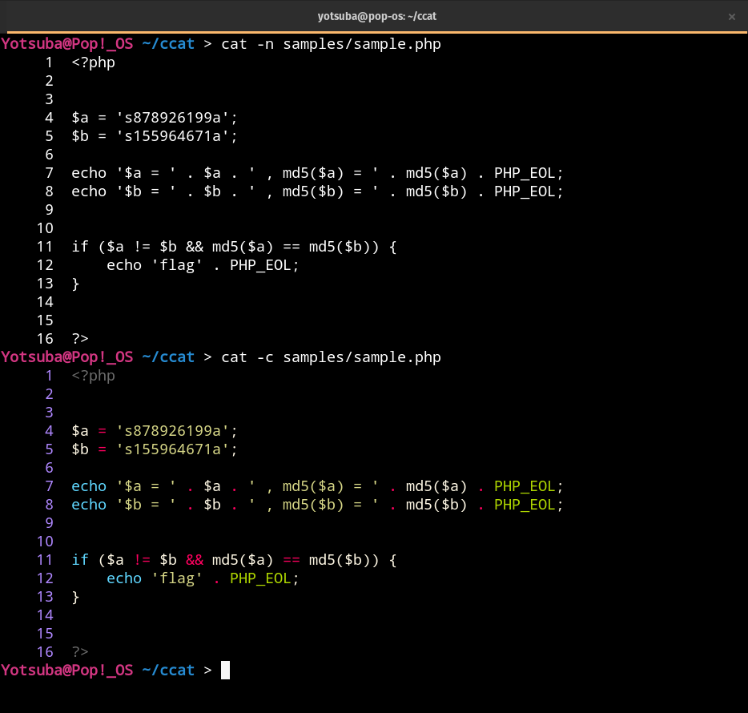

# ccat.sh



ccat.sh is a wapper of Linux "cat" command, it provides a extensional option "-c" that makes output of "cat" colorful.

The option "-c" means colorful.

## Dependency

ccat.sh depends on [Pygments](https://pygments.org/) to highlight the files.

```
$ pip install Pygments
```

## Install

```
$ curl --create-dirs -o ~/.config/ccat/ccat.sh https://raw.githubusercontent.com/Yooootsuba/ccat/master/ccat.sh
$ echo "source ~/.config/ccat/ccat.sh" >> ~/.bashrc
```

## Custom highlighting style


I wrote a script that shows all style in [Pygments](https://pygments.org/) supported.

Press "Enter" key until the style of you like appears, and copy the style name manually.

```
$ python styles.py
```

You will find the following line ```cat -n $arguments | pygmentize -g -O style=default```, then replace the ```default``` with your favorite style name.

```
$ vim ~/.config/ccat/ccat.sh
```

## License

MIT License
